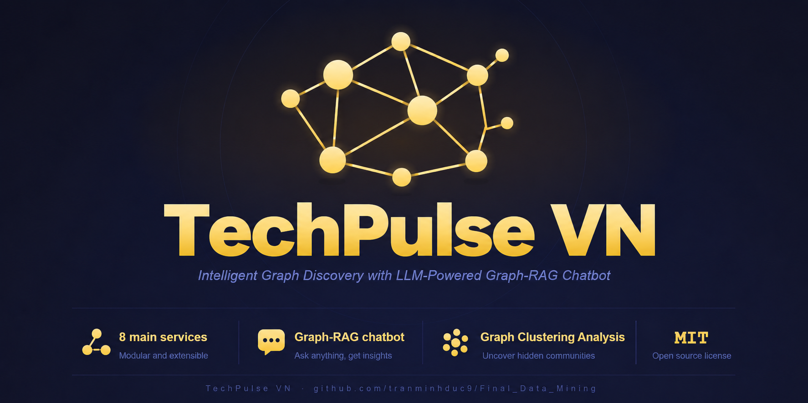
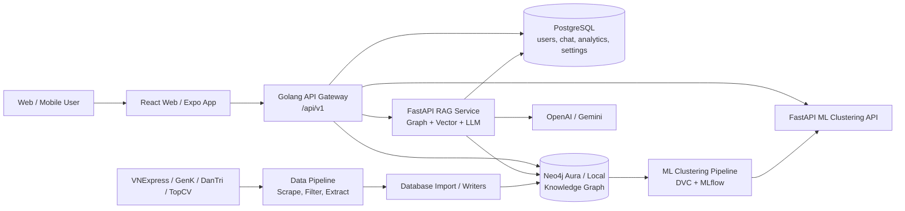

<p align="center">
  <a href="https://opensource.org/licenses/MIT"></a>
  <a href="https://github.com/tranminhduc9/Final_Data_Mining/stargazers"></a>
  <a href="https://github.com/tranminhduc9/Final_Data_Mining/graphs/contributors"></a>
</p>

# TechRadar VN

**TechRadar VN** là nền tảng phân tích xu hướng công nghệ và thị trường tuyển dụng IT tại Việt Nam. Project kết hợp crawler dữ liệu, xử lý NLP tiếng Việt, knowledge graph, dashboard trực quan, phân cụm công nghệ và chatbot Graph RAG để giúp người dùng theo dõi công nghệ đang tăng trưởng, so sánh mức độ phổ biến, khám phá quan hệ giữa công nghệ - công ty - việc làm và hỏi đáp trên dữ liệu đã thu thập.

## Mục lục

- [Tổng quan](#bức-tranh-tổng-quan)
- [Kiến trúc hệ thống](#kiến-trúc-hệ-thống)
- [Luồng dữ liệu](#luồng-dữ-liệu)
- [Tính năng chính](#tính-năng-chính)
- [Cấu trúc thư mục](#cấu-trúc-thư-mục)
- [Tech stack](#tech-stack)
- [API và service ports](#api-và-service-ports)
- [Cài đặt nhanh](#cài-đặt-nhanh)
- [Chạy từng module khi phát triển](#chạy-từng-module-khi-phát-triển)
- [Kiểm thử](#kiểm-thử)
- [Tài liệu liên quan](#tài-liệu-liên-quan)

## Bức tranh tổng quan

### Bài toán

Dữ liệu về ngành IT Việt Nam nằm rải rác ở nhiều nguồn: bài viết công nghệ, tin tuyển dụng, thông tin công ty, mức lương, kỹ năng và xu hướng cộng đồng. Nếu chỉ đọc rời rạc từng nguồn, rất khó trả lời các câu hỏi như:

- Công nghệ nào đang tăng trưởng nhanh trong thị trường tuyển dụng?
- Một công nghệ liên quan đến công ty, vị trí, kỹ năng và bài viết nào?
- Nên học công nghệ nào tiếp theo dựa trên nền tảng hiện tại?
- Chatbot có thể trả lời dựa trên dữ liệu thật thay vì suy đoán không?

### Cách project giải quyết

TechPulse VN xây dựng một pipeline khép kín:

```text
Nguồn dữ liệu
  -> Crawler
  -> Lọc IT / Non-IT
  -> Trích xuất thực thể
  -> Neo4j Knowledge Graph + PostgreSQL
  -> RAG / Clustering / Analytics
  -> Web app + Mobile app + API
```

Trọng tâm của hệ thống là **knowledge graph** trong Neo4j, nơi các node như `Article`, `Technology`, `Company`, `Job`, `Skill`, `Location` được liên kết bằng các quan hệ như `MENTIONS`, `REQUIRES`, `POSTED_BY`, `USES`, `RELATED_TO`. Từ graph này, backend cung cấp dashboard phân tích, graph explorer, so sánh công nghệ, chatbot RAG và API phân cụm công nghệ.

## Kiến trúc hệ thống



### Vai trò các khối chính

| Khối | Vai trò |
|---|---|
| Frontend web | Giao diện dashboard, so sánh, graph explorer, chatbot, clustering và admin. |
| Frontend mobile | Ứng dụng Expo/React Native dùng chung hướng chức năng với web. |
| Golang API | API public duy nhất cho frontend, xử lý auth, profile, admin, analytics, chat session, proxy RAG và clustering. |
| RAG service | FastAPI service trả lời câu hỏi bằng vector search, graph traversal, reranking và LLM generation. |
| ML clustering | Pipeline phân cụm `Technology` bằng graph/content features, MLflow tracking, DVC và API tra cứu cluster. |
| Data pipeline | Thu thập dữ liệu từ VNExpress, GenK, Dân Trí, TopCV; lọc bài IT; trích xuất entity. |
| Database module | Công cụ tạo schema, import dữ liệu, tạo quan hệ Neo4j, writer/orchestrator Go và tài liệu graph schema. |
| Test suite | Pytest cho backend, RAG, clustering, data pipeline và database integrity. |

## Luồng dữ liệu

### 1. Thu thập và chuẩn hóa dữ liệu

```text
VNExpress / GenK / DanTri / TopCV
  -> Selenium / undetected-chromedriver scrapers
  -> raw_data/*.json
  -> PhoBERT title classifier
  -> filtered_data/*.json
  -> ELECTRA NER + regex/dictionary rules
  -> extracted_data/*.json
```

Các thực thể được trích xuất gồm `PER`, `ORG`, `LOC`, `DATE`, `TECH`, `JOB_ROLE`, `SALARY`.

### 2. Nạp vào graph database

```text
extracted_data
  -> transform/import scripts
  -> Neo4j nodes: Article, Technology, Company, Job, Skill, Location
  -> relationships: MENTIONS, REQUIRES, POSTED_BY, USES, RELATED_TO
```

Neo4j là nguồn dữ liệu chính cho radar, compare, graph explorer, RAG retriever và feature engineering của clustering.

### 3. Graph RAG chatbot

```text
User query
  -> Golang API /api/v1/chat
  -> RAG service /chat
  -> entity extraction
  -> vector search Article
  -> graph traversal Job / Company / Technology
  -> user profile context
  -> reranker
  -> prompt builder
  -> OpenAI hoặc Gemini
  -> answer + sources
```

RAG service có endpoint embedding để cập nhật vector cho bài viết mới và có thể lưu lịch sử chat vào PostgreSQL.

### 4. Phân cụm công nghệ

```text
Neo4j Technology snapshot
  -> graph/content feature pipeline
  -> DBSCAN / HDBSCAN / KMeans training
  -> MLflow experiment tracking
  -> LLM labeling
  -> local/S3 artifacts
  -> clustering API
  -> frontend cluster dashboard
```

Mục tiêu của module này là thay thế category thủ công kém chính xác, gom công nghệ thành nhóm có ý nghĩa để hỗ trợ trend analysis và recommendation.

## Tính năng chính

| Nhóm | Tính năng |
|---|---|
| Trend Radar | Top công nghệ tăng trưởng, biểu đồ theo thời gian, top 10 công nghệ, export PNG/CSV. |
| Compare | So sánh nhiều công nghệ theo growth, YoY/MoM, jobs, peak month và summary bằng LLM. |
| Graph Explorer | Khám phá graph công nghệ, lọc theo location/salary/sentiment, phân tích lộ trình quan hệ. |
| Chatbot RAG | Chat theo session, JWT auth, trả lời dựa trên Article + Job + Company + Technology + user profile. |
| Clustering | Danh sách cluster, chi tiết cluster, tra cứu công nghệ thuộc cluster nào, batch lookup. |
| Auth & Profile | Register, login, refresh token, logout, user profile, role/status user. |
| Admin | Quản lý user, settings, maintenance mode, feature flags, analytics dashboard. |
| DataOps | Scraping, filtering, entity extraction, import graph, embedding, MLflow/DVC tracking. |

## Cấu trúc thư mục

```text
Tech_Radar/
├── banner.png
├── docker-compose.yml             # Compose chính cho web, Go API, RAG, clustering, Redis, Neo4j, MLflow
├── requirements.txt               # Python dependencies tổng hợp cho root/test
├── pytest.ini
├── docs/                          # Tài liệu API, database, báo cáo và PDF
├── tests/                         # Test suite toàn dự án
│
└── src/
    ├── frontend/
    │   ├── web/                    # React 19 + Vite web app
    │   └── app/                    # Expo / React Native mobile app
    │
    ├── backend/
    │   ├── golang-api/             # Gin API Gateway, PostgreSQL, Neo4j, JWT, Swagger
    │   ├── python-api/             # Internal FastAPI AI skeleton cho LLM/OCR mở rộng
    │   └── docs/                   # Backend architecture, API/database docs
    │
    ├── ai-rag-core/                # FastAPI Graph RAG service
    │   ├── app/api/                # /chat, /health, /embed endpoints
    │   ├── app/core/               # embedder, retriever, reranker, prompt, generator
    │   ├── app/db/                 # Neo4j/PostgreSQL clients
    │   └── scripts/                # embed articles, create vector index, evaluate RAG
    │
    ├── ml-clustering/              # Technology clustering pipeline + serving API
    │   ├── app/                    # FastAPI cluster lookup API
    │   ├── pipelines/              # DVC stages: extract, features, train, label, writeback
    │   ├── src/                    # data, features, clustering, labeling, tracking
    │   └── params.yaml             # Tham số pipeline
    │
    ├── data-pipeline/              # Scrapers, PhoBERT filter, entity extraction
    ├── database/                   # Neo4j schema/import/crawler/orchestrator tooling
    ├── shared/                     # Placeholder cho code dùng chung
    ├── scripts/                    # Placeholder cho automation scripts
    └── docs/                       # Package marker/tài liệu module
```

## Tech stack

| Lớp | Công nghệ |
|---|---|
| Web frontend | React 19, Vite 7, React Router, D3, Recharts, react-force-graph-2d. |
| Mobile frontend | Expo 54, React Native 0.81, Expo Router, React Navigation, chart libraries. |
| Backend API | Go, Gin, JWT, pgx/PostgreSQL, Neo4j Go Driver, Swagger. |
| RAG service | Python 3.11+, FastAPI, SQLAlchemy async, Neo4j Python Driver, SentenceTransformers, reranker ONNX/CrossEncoder, OpenAI/Gemini. |
| ML clustering | scikit-learn, Neo4j GDS, DVC, MLflow, pandas/numpy, HDBSCAN/DBSCAN/KMeans, LLM labeling. |
| Data pipeline | Python, Selenium, undetected-chromedriver, PhoBERT, ELECTRA NER, underthesea, regex rules. |
| Databases | PostgreSQL, Neo4j Aura/local, Redis cache; Qdrant tooling còn nằm trong database module. |
| DevOps | Docker, Docker Compose, MLflow servers, pytest. |


## Cài đặt nhanh

### 1. Chuẩn bị

Yêu cầu tối thiểu:

- Docker + Docker Compose
- Node.js 20+ nếu chạy frontend ngoài Docker
- Go theo `src/backend/golang-api/go.mod`
- Python 3.11+ cho RAG/clustering; Python 3.12+ được khuyến nghị khi chạy toàn bộ test suite
- Chrome/ChromeDriver nếu chạy crawler Selenium
- Tài khoản/connection cho PostgreSQL và Neo4j Aura nếu không dùng local
- API key LLM (`OPENAI_API_KEY` hoặc `GEMINI_API_KEY`)

### 2. Tạo file môi trường

```bash
cp .env.example .env
```

Các biến quan trọng cần điền:

| Nhóm | Biến |
|---|---|
| App/API | `APP_ENV`, `PORT`, `ALLOWED_ORIGINS`, `JWT_SECRET` |
| PostgreSQL | `PostgreSQL_CONNECTION_STRING`, `POSTGRES_HOST`, `POSTGRES_DB`, `POSTGRES_USER`, `POSTGRES_PASSWORD` |
| Neo4j | `NEO4J_URI`, `NEO4J_USERNAME`, `NEO4J_PASSWORD`, `NEO4J_DATABASE`, `USE_LOCAL_NEO4J` |
| LLM | `OPENAI_API_KEY`, `GEMINI_API_KEY`, `LLM_PROVIDER`, `LLM_MODEL` |
| RAG/Embed | `EMBED_SECRET`, `REDIS_URL` |
| Clustering artifacts | `MLCLUSTER_S3_*`, `MLCLUSTER_SNAPSHOT_TAG`, `MLCLUSTER_RELOAD_TTL_SECONDS` |

### 3. Chạy toàn hệ thống bằng Docker Compose

```bash
docker compose up --build
```

Kiểm tra nhanh:

```bash
curl http://localhost:8080/health
curl http://localhost:8000/health
```

Sau khi khởi động, mở web app tại `http://localhost:5173`.

## Chạy từng module khi phát triển

### Frontend web

```bash
cd src/frontend/web
npm install
npm run dev
```

### Frontend mobile

```bash
cd src/frontend/app
npm install
npm run start
```

### Golang API

```bash
cd src/backend/golang-api
go mod download
go run ./cmd/api
```

### RAG service

```bash
cd src/ai-rag-core
python -m venv .venv
# Windows: .venv\Scripts\activate
# macOS/Linux: source .venv/bin/activate
pip install -r requirements.txt
uvicorn app.main:app --host 0.0.0.0 --port 8000 --reload
```

Các script hữu ích:

```bash
python scripts/create_vector_index.py
python scripts/embed_articles.py
python scripts/evaluate_rag.py
```

### ML clustering

Chạy API phục vụ cluster artifacts:

```bash
cd src/ml-clustering
pip install -r requirements-api.txt
uvicorn app.main:app --host 0.0.0.0 --port 8001 --reload
```

Chạy pipeline training:

```bash
cd src/ml-clustering
pip install -r requirements.txt
dvc repro
mlflow ui --backend-store-uri sqlite:///mlruns.db
```

Hoặc chạy từng stage:

```bash
python -m pipelines.stage_01_extract --tag 2026-05-06
python -m pipelines.stage_02_features --tag 2026-05-06
python -m pipelines.stage_03_train --tag 2026-05-06 --experiment tech_clustering_v1
python -m pipelines.stage_04_label --run-id <mlflow_run_id>
python -m pipelines.stage_05_writeback --run-id <mlflow_run_id>
```

### Data pipeline

```bash
cd src/data-pipeline
python scrape_from_DT.py
python scrape_from_GenK.py
python scrape_from_topCV.py
python scrape_from_VN-EP.py
python filter_data.py
python extract_data.py
```

Lưu ý: `scrape_from_topCV.py` dùng `undetected_chromedriver`, cần chỉnh `version_main` khớp Chrome local nếu gặp lỗi driver.

### Database tooling

```bash
cd src/database
pip install -r requirements.txt
python utils/run_complete_pipeline.py
python utils/create_relationships.py
```

Tài liệu schema và deployment nằm trong `src/database/docs/`.

## Kiểm thử

Chạy toàn bộ test suite:

```bash
python -m pytest tests/ -v
```

Chạy theo nhóm:

```bash
python -m pytest tests/test_backend/ -v
python -m pytest tests/test_rag/ -v
python -m pytest tests/test_clustering/ -v
python -m pytest tests/test_data_pipeline/ -v
python -m pytest tests/test_database/ -v
```

Một số integration tests yêu cầu service thật đang chạy và `.env` hợp lệ, đặc biệt là Neo4j, PostgreSQL, RAG service và Golang API.

## Tài liệu liên quan

| File | Nội dung |
|---|---|
| `docs/API_DOCs_v1.md` | Tài liệu API cấp project. |
| `docs/API_DOCs_v1.pdf` | Bản PDF tài liệu API. |
| `docs/datamining.pdf` | Báo cáo/tài liệu Data Mining. |
| `src/backend/backend_architecture.md` | Kiến trúc backend Go + Python service. |
| `src/backend/docs/client_database_docs.md` | Mô tả PostgreSQL cho app/web. |
| `src/ai-rag-core/README.md` | Tài liệu chi tiết RAG service. |
| `src/ml-clustering/README.md` | Tài liệu pipeline phân cụm công nghệ. |
| `src/data-pipeline/README.md` | Tài liệu scraper, filter và entity extraction. |
| `src/database/README.md` | Tài liệu database module, Neo4j, Kafka/Airflow tooling. |
| `src/database/docs/graph_schema.md` | Graph schema Neo4j. |
| `tests/README.md` | Cấu trúc và cách chạy test suite. |

## Contributors

<a href="https://github.com/tranminhduc9/Final_Data_Mining/graphs/contributors">
  
</a>
